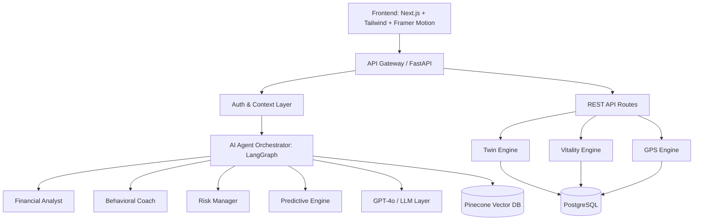
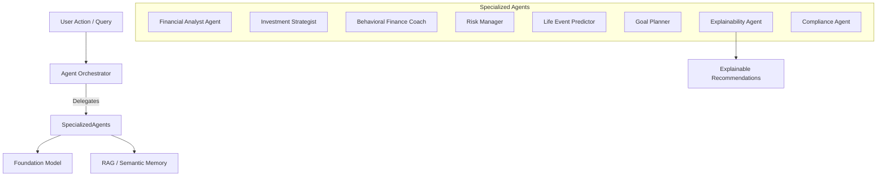
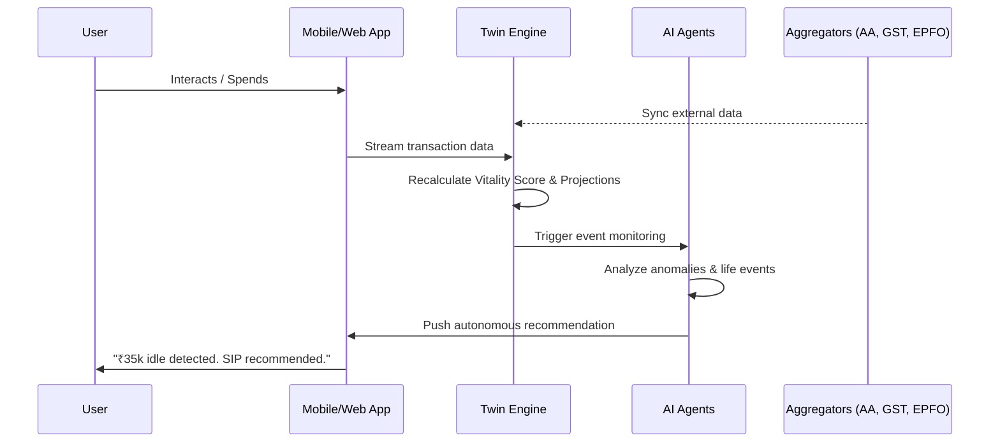

# FINANCIAL TWIN AI — Hackathon Master Deliverables

This document contains all 20 deliverables required for the hackathon pitch and technical submission.

---

## 1. Product Vision
To transform banking from a reactive transactional utility into a proactive, intelligent, and autonomous financial partner. **Financial Twin AI** creates a living digital representation of every customer’s financial life, continuously predicting, advising, optimizing, and protecting their financial future. The vision is to give every individual a private wealth manager available 24/7, making elite wealth creation strategies accessible to all.

## 2. Problem Statement Reframing
**Current Paradigm:** "How can we build a chatbot to help users navigate our banking app?"  
**Reframed Paradigm:** "How can we anticipate a user's financial needs before they occur, prevent wealth erosion, and automatically navigate them toward financial freedom?"  
Customers don't want to manage their money; they want their money managed for them safely. They face information overload, fragmented financial data, and reactive banking alerts. Our solution shifts the paradigm from *financial reporting* to *financial anticipation and autonomous optimization*.

## 3. Unique Value Proposition (UVP)
**For the Customer:** A personalized financial digital twin that knows your goals, simulates your future, and proactively coaches you to financial vitality, preventing costly mistakes.  
**For the Bank:** Hyper-personalization at scale. Transforming the bank into the primary financial advisor, leading to 3x engagement, 40% higher product adoption, and unparalleled customer retention through predictive AI.

## 4. System Architecture Diagram

## 5. AI Architecture Diagram

## 6. Data Flow Diagram

## 7. Patent-Worthy Innovations
1. **Financial Digital Twin Engine**: Continuous state machine that mirrors real-world finances, utilizing multi-modal data (UPI, EPFO, GST, Account Aggregator) to map past, current, and future trajectory.
2. **Financial Vitality Score™**: A multidimensional health metric (0-100) replacing standard credit scores, evaluating liquidity, discipline, growth, and stress resilience.
3. **Life Event Prediction Engine**: ML models utilizing transaction metadata to forecast major life milestones (marriage, home purchase) with probability scores before they occur.
4. **Wealth GPS™**: Turn-by-turn navigation for financial goals, recalculating ETAs dynamically based on market shifts and spending behavior.

## 8. UI Screens
- **Dashboard:** Central hub featuring the Vitality Score, Health Timeline, and personalized action cards.
- **Financial Twin:** Interactive radar and wealth trajectory simulator plotting optimistic, realistic, and pessimistic futures.
- **Wealth GPS:** Route visualization for goals, showing monthly gaps, waypoints, and alternative routes.
- **Simulator:** What-if scenarios (e.g., "Buy a Car", "Job Loss") demonstrating immediate impact on 5-year net worth.
- **AI Advisor:** Human-like chat interface with embedded confidence scores, reasoning layers, and actionable buttons.
- **Stress Monitor:** Early warning system gauge and active signal detection for financial risk prevention.
- **Life Events:** Predictive cards showing probability of upcoming events and readiness scores.

## 9. User Journey
1. **Onboarding (0s - 3s):** Rahul connects accounts. Financial Twin is generated instantly.
2. **Diagnosis:** System calculates Vitality Score (72) and identifies 'Liquidity Readiness' as low.
3. **Prediction:** Engine predicts 87% chance of Home Purchase in 6 months.
4. **Simulation:** Rahul asks, "What if I buy a ₹25L car instead?" The Simulator shows goal completion dropping by 25%.
5. **Autonomous Action:** The AI Coach automatically suggests a SIP increase to get back on track. Rahul approves with one click.

## 10. Technical Architecture
- **Frontend:** Next.js 16, React 19, TypeScript, Tailwind CSS v4, Framer Motion, Recharts.
- **Backend:** Python 3.10+, FastAPI, Pydantic.
- **Database:** PostgreSQL (Relational), Pinecone (Vector/Embeddings).
- **AI/ML:** GPT-4o (Reasoning), LangGraph (Agent orchestration), XGBoost/Prophet (Predictive modeling).

## 11. API Design
- `GET /api/dashboard`: Aggregated summary (Vitality, Twin Snapshot, Top Events).
- `GET /api/vitality`: Detailed 8-dimension health score.
- `GET /api/twin`: Current state and 1/3/5/10 year projections.
- `GET /api/wealth-gps`: Goals, ETAs, and turn-by-turn route.
- `POST /api/simulator`: Run arbitrary what-if parameters.
- `POST /api/advisor/chat`: Interact with LangGraph agent cluster.
- `GET /api/stress`: Fetch 30/90/365-day stress risk models.
- `GET /api/life-events`: Fetch ML-predicted life events and probabilities.

## 12. Database Schema (High-Level)
- **`customers`**: ID, name, age, risk_profile, income.
- **`transactions`**: ID, customer_id, amount, category, timestamp, merchant.
- **`portfolios`**: ID, customer_id, asset_class, value, return_rate.
- **`goals`**: ID, customer_id, target_amount, target_date, current_saved.
- **`twin_states`**: ID, customer_id, snapshot_date, vitality_score, net_worth.
- **`predictions`**: ID, customer_id, event_type, probability, date_predicted.

## 13. ML Models
1. **Life Event Prediction:** XGBoost classifier trained on categorical transaction velocity and amounts.
2. **Trajectory Projection:** Prophet-based time-series forecasting for net worth growth and income stability.
3. **Stress Early Warning:** LSTM neural network analyzing sequential cash-flow dips and EMI burden spikes.
4. **Categorization:** BERT-based embeddings for hyper-granular transaction labeling.

## 14. Agent Workflows
1. **User asks question** -> Orchestrator parses intent.
2. **Data retrieval** -> Orchestrator asks *Financial Analyst* for current portfolio state.
3. **Analysis** -> *Investment Strategist* creates recommendations based on state.
4. **Review** -> *Risk Manager* verifies recommendations against user risk profile.
5. **Formatting** -> *Explainability Agent* adds confidence metrics and "Why/How" layers.
6. **Response** -> Presented to User via AI Avatar.

## 15. Pitch Deck Structure
- **Slide 1:** Title - Financial Twin AI.
- **Slide 2:** The Problem - Reactive banking is failing customers.
- **Slide 3:** The Solution - A proactive Financial Digital Twin.
- **Slide 4:** Patent-Worthy Innovation 1 - Vitality Score & Twin Engine.
- **Slide 5:** Patent-Worthy Innovation 2 - Predictive Life Events & Wealth GPS.
- **Slide 6:** Live Demo.
- **Slide 7:** Business Impact (40% engagement, 30% conversion).
- **Slide 8:** Technical Stack & AI Architecture.
- **Slide 9:** Future Roadmap.
- **Slide 10:** The Team & Conclusion.

## 16. Demo Script
1. **Hook:** "Meet Rahul. He's 32, earns ₹18L, and wants to buy a house. His current bank just shows him a static balance."
2. **Twin:** "With Financial Twin AI, Rahul sees his living financial mirror. His Vitality Score is 72."
3. **Prediction:** "Our ML engine notices furniture and security deposit trends. It predicts an 87% chance he's buying a house."
4. **GPS & Simulator:** "Rahul wonders, 'What if I buy a car first?' We simulate it instantly. The AI shows his house goal will be delayed by 2 years."
5. **Autonomous Action:** "The Autonomous Coach steps in, finding ₹35,000 idle cash and suggesting a liquid fund to get him back on track."
6. **Close:** "This isn't a dashboard. It's a financial co-pilot."

## 17. Judge Q&A Preparation
- **Q: How is this different from PFM (Personal Finance Management)?**
  - *A: PFMs look backward (where did my money go?). Financial Twin looks forward (where is my money going, and how do I change it?).*
- **Q: How do you handle hallucinations?**
  - *A: Our agent architecture includes a strict Compliance Agent and an Explainability layer that forces the LLM to cite exact data points.*
- **Q: How scalable is the Twin computation?**
  - *A: We use event-driven architecture. The twin state is only recalculated via Kafka streams when significant threshold events occur, not on every page load.*

## 18. Monetization Strategy
- **Direct Cross-Sell:** AI contextually recommends high-margin bank products (Loans, Insurance, MFs) exactly when the user needs them.
- **Premium Advisory Tier:** Base twin is free. Generative Simulator and access to the dedicated Human+AI hybrid advisor is a subscription model (e.g., ₹499/month).
- **Lead Generation:** Pre-qualified, intent-driven leads for the bank's wealth management and mortgage divisions (e.g., 87% home purchase intent = instant mortgage pre-approval).

## 19. Scalability Strategy
- **Compute:** FastAPI backend horizontally scaled on Kubernetes.
- **Data:** TimescaleDB (Postgres extension) for efficient time-series transaction data.
- **AI Inference:** Batching non-critical predictions. Edge caching for static agent responses.
- **Asynchronous:** LangGraph workflows execute in background workers (Celery/Redis) with WebSocket pushing results to UI to avoid HTTP timeouts.

## 20. Future Roadmap
- **Next 6 Months:** Full AA (Account Aggregator) integration. Voice-enabled AI Avatar (WebRTC).
- **Next 12 Months:** "Auto-Pilot Mode" where the AI executes SIPs and tax-loss harvesting automatically (with user consent limits).
- **Next 24 Months:** Multi-player mode (Household Financial Twins) merging spouse finances for unified family wealth planning.
